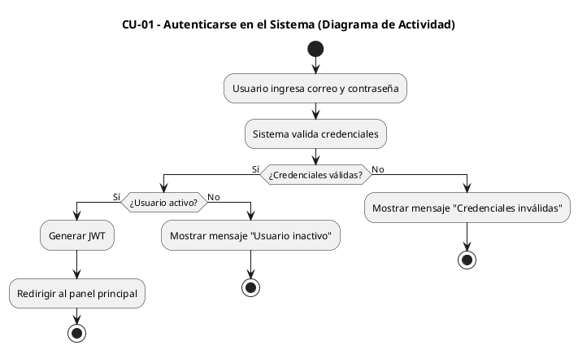
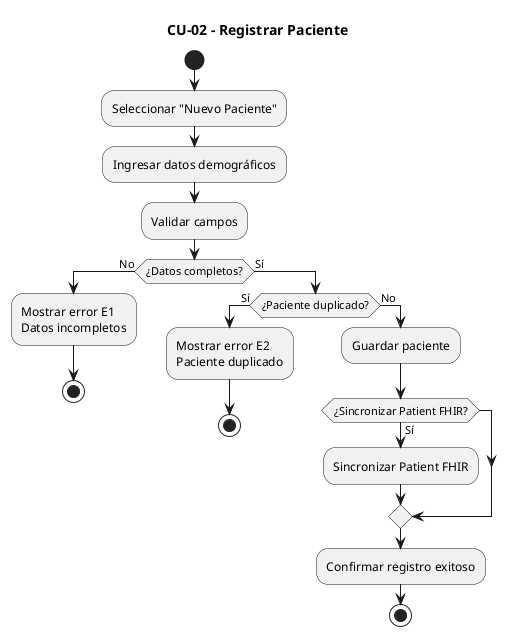
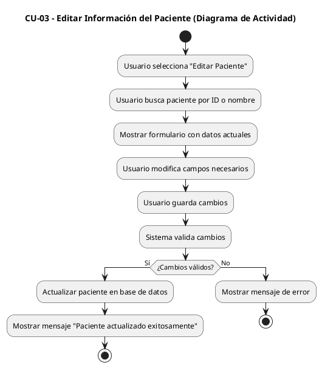
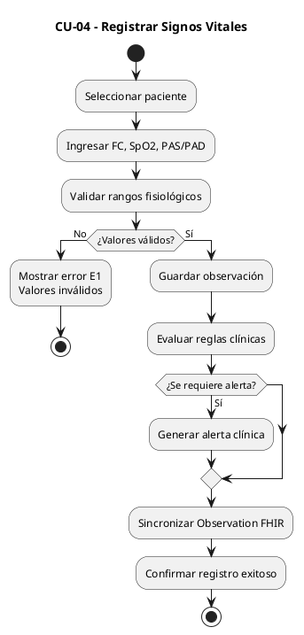
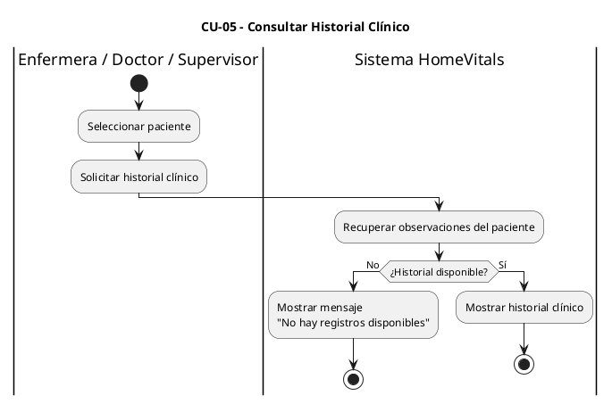
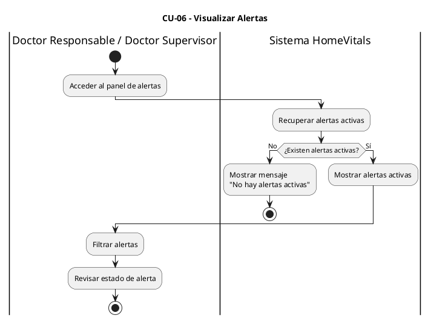
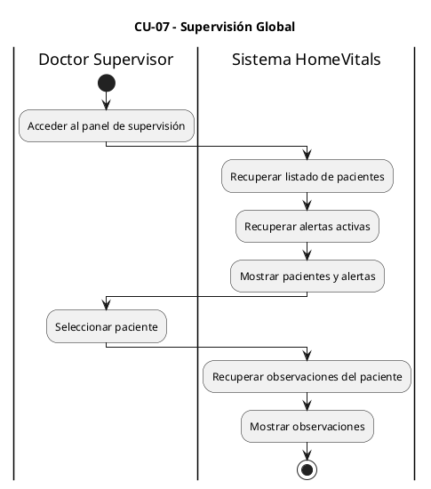

<h1 align="center">Mediwatch</h1>
Es una mini plataforma clínica diseñada para el monitoreo de signos vitales de pacientes, permitiendo la gestión básica de pacientes, el registro clínico de observaciones y la supervisión médica mediante alertas automáticas por valores fuera de rango.

## Indice
- [Objetivo](#objetivo)
- [Arquitectura General](#arquitectura-general)
- [Enlaces a](#enlaces-a)
- [01-Alcance](#01-alcance)
- [02-Requisitos](#02-requisitos)
- [03-Actores-roles-permisos](#03-actores-roles-permisos)
- [04-Casos-de-Uso](#04-casos-de-uso)

## Objetivo
El presente proyecto tiene como objetivo diseñar y desarrollar una plataforma de monitoreo clínico orientada a entornos de telemedicina, comprendiendo los estándares, requisitos técnicos y buenas prácticas necesarias para la implementación de un sistema seguro, escalable y alineado con normativas del sector salud, aplicando los estandares:

- Estandar FHIR con Google Clud Healthcare API
- Control por roles (RBAC)
- JWT Auth
- Validación DTO
- Auditoría (quién registró qué)

## Arquitectura general

## Enlaces a:
> [!Tip]
> Enlaces a los repositorios de GitHub
> Backend [link](https://github.com/sonick-s/mediwatch-backend.git)
> Frontend [link](https://github.com/sonick-s/mediwatch-frontend.git)

## 01-Alcance
El alcance incluye la gestión de usuarios médicos y administrativos, la administración básica de pacientes, el registro manual de signos vitales, la consulta de historial clínico y la generación de alertas simples ante valores fuera de rangos normales.

## 02-Requisitos
| Requisitos Técnicos (TR) | Requisitos Funcionales (FR) | Requisitos No Funcionales (NFR) |
|--------------------------|-----------------------------|----------------------------------|
| Arquitectura Cloud: El sistema deberá desplegarse en Google Cloud Platform. |  Autenticación de Usuarios: El sistema deberá permitir a los usuarios autenticarse mediante credenciales válidas. | Seguridad: El sistema deberá implementar JWT, hashing bcrypt, RBAC y HTTPS. |
| Backend: El backend deberá implementarse en Java con Sprint, desplegarse en Cloud Run y ejecutarse en Docker. | Gestión de Usuarios: El sistema deberá permitir crear usuarios, asignar roles, editar información básica y desactivar usuarios. | Privacidad de Datos: El sistema deberá proteger la información clínica y personal del paciente. |
| Base de Datos: El sistema deberá utilizar PostgreSQL (Cloud SQL) para datos operativos. | Control de Acceso (RBAC): El sistema deberá restringir el acceso según roles definidos. | Rendimiento: Las operaciones críticas deberán responder en menos de 2 segundos. |
| Datos Clínicos: Los datos clínicos deberán almacenarse en un FHIR Store (Healthcare API). | Registro de Pacientes: El sistema deberá permitir registrar pacientes con datos demográficos básicos. | Disponibilidad: El sistema deberá garantizar alta disponibilidad en Cloud Run. |
| Gestión de Secretos: Las credenciales deberán almacenarse en Secret Manager "Posible cambio". | Gestión Básica de Pacientes: El sistema deberá permitir editar, visualizar y desactivar pacientes. | Integridad de Datos: El sistema deberá prevenir duplicados e inconsistencias. |
| Registro de Logs: Los eventos del sistema deberán registrarse en Cloud Logging. | Registro de Signos Vitales: El sistema deberá permitir registrar FC, SpO2 y PAS/PAD. | Auditoría y Logging: El sistema deberá registrar usuario, operación y timestamp. |
|  | Validación de Datos Clínicos: El sistema deberá validar rangos fisiológicos plausibles. | Escalabilidad: El backend deberá soportar escalado horizontal automático. |
|  | Historial Clínico: El sistema deberá permitir visualizar historial de observaciones por paciente. | Usabilidad: La interfaz deberá ser clara e intuitiva para personal clínico. |
|  | Generación de Alertas: El sistema deberá generar alertas ante valores fuera de rango. |  |
|  | Supervisión Médica: El sistema deberá permitir a médicos supervisores consultar pacientes y observaciones. |  |
|  | Integración FHIR: El sistema deberá sincronizar Patient y Observation mediante Healthcare API. |  |

## 03-Actores-Roles-Permisos
| Actor | Descripción | Responsabilidades | Permisos en el Sistema | Restricciones |
|-------|-------------|-------------------|------------------------|---------------|
| Personal Administrativo / Recepción | Usuario responsable de la gestión administrativa del paciente dentro del sistema. | - Registro de pacientes - Actualización de datos demográficos - Verificación de información básica - Gestión de estado del paciente | - Crear pacientes - Editar pacientes - Visualizar listado de pacientes - Desactivar pacientes | - No registra signos vitales - No accede a historial clínico detallado - No gestiona alertas |
| Enfermera / Personal de Enfermería | Usuario clínico encargado del registro de signos vitales del paciente. | - Toma de signos vitales - Registro de observaciones - Seguimiento rutinario | - Ver pacientes asignados - Registrar signos vitales - Consultar historial básico | - No crea pacientes - No edita datos administrativos - No administra usuarios |
| Doctor Responsable | Profesional médico encargado del control clínico directo del paciente. | - Supervisión clínica - Validación de observaciones - Evaluación de alertas | - Registrar signos vitales - Consultar historial clínico - Visualizar alertas del paciente - Supervisión de evolución clínica | - No administra usuarios - No gestiona configuración del sistema |
| Doctor Supervisor / Médico Encargado | Usuario con rol jerárquico de supervisión clínica transversal. | - Supervisión global - Revisión de observaciones - Control de alertas críticas | - Ver todos los pacientes - Ver todas las observaciones - Visualizar alertas globales - Supervisión clínica transversal | - No gestiona configuración técnica - No administra infraestructura |
| Administrador del Sistema / IT | Usuario técnico responsable de la administración del sistema. | - Gestión de usuarios - Configuración del sistema - Auditoría técnica | - Crear usuarios - Asignar roles - Gestionar permisos - Revisar logs - Configurar parámetros del sistema | - No registra signos vitales - No interviene en decisiones clínicas |

## 04-Casos-de-Uso

 Casos de uso modelados en Plant Uml como Diagramas de Actividad (UML Activity Diagram)
   
CU-01 – Autenticarse en el Sistema

CU-02 – Registrar Paciente

CU-03 – Editar Información del Paciente

CU-04 – Registrar Signos Vitales

 

CU-05 – Consultar Historial Clínico

 

CU-06 – Visualizar Alertas

 

CU-07 – Supervisión Global

 

